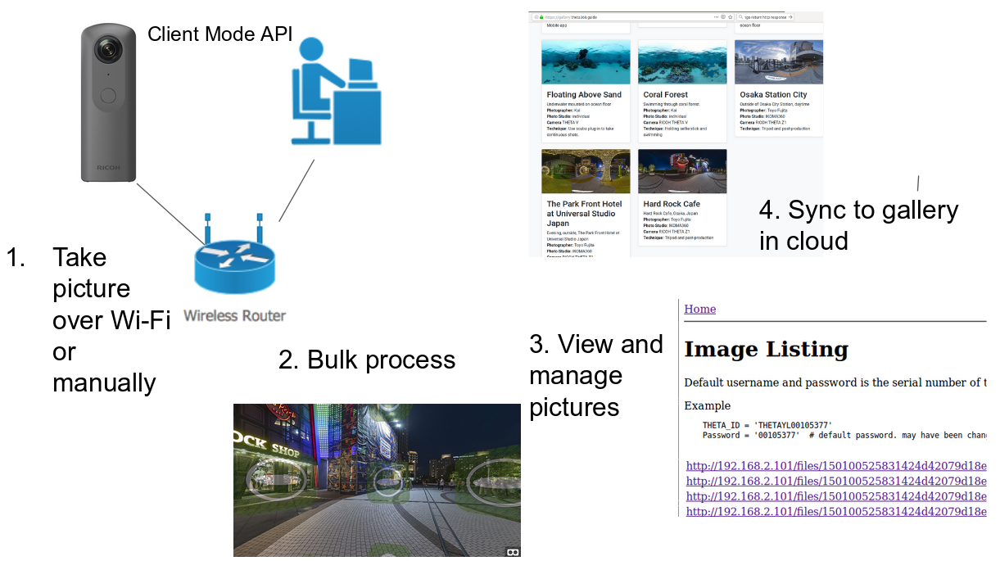

# Test of Django to Access RICOH THETA  API commands

## THETA Django Workflow

This is one of three repos with sample code.

1. RICOH THETA API commands (this project)
2. [django-exiftool](https://github.com/codetricity/django-exiftool) - example of using shell commands with Django
3. [theta gallery](https://github.com/codetricity/theta360-gallery) - display 360 images in a gallery. 

[Live Gallery Site](https://gallery.theta360.guide/)

## Send API commands to RICOH THETA

This test uses [THETA Client mode](https://github.com/codetricity/theta-client-mode).

## Finding IP address of THETA

in `tools/`, `find-theta.py` can find the IP address of the THETA on your network.
Add the IP address to `shell/views.py`

## Important Configuration

in views.py, you must change the IP address, ID, and password to the 
settings for your specific camera.

    THETA_IP = '192.168.2.101'
    THETA_ID = 'THETAYL00105377'
    THETA_PASSWORD = '00105377'  # default password. may have been changed

## Discussion

